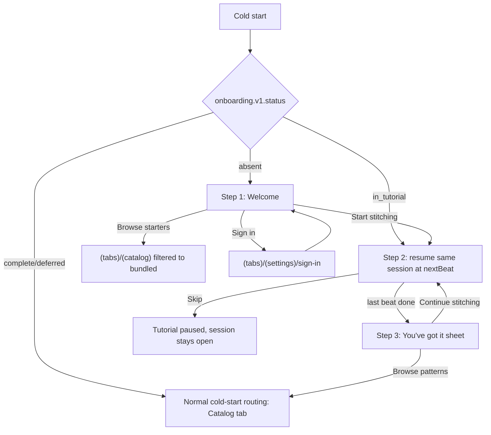

# First-Run Onboarding Scenario

Status: proposal (not yet implemented; branch `onboarding` has no onboarding code).
Scope: cold first launch through the player's first stitches. Everything after the first
Session Completion is out of scope.

This scenario is constrained by the accepted domain in `CONTEXT.md` and by ADR-0030
(accessible numbered controls), ADR-0031 (interaction budget), ADR-0033 (rewarded ads),
ADR-0035 (observability), and ADR-0037 (bundled starter patterns). Where a plausible
onboarding idea conflicts with those documents, the document wins and the conflict is
called out explicitly below.

## 0. Design rules this scenario obeys

1. **No forced registration.** Guest play is one tap from the first frame. Sign-in exists
   only as a low-emphasis secondary affordance.
2. **Fully offline.** The entire flow, including the tutorial, runs from a Bundled Starter
   Pattern (ADR-0037) with no Guest Installation Identity and no network. "A generic
   connection screen never replaces usable local content" (`CONTEXT.md`, Connectivity State).
3. **No paywall, no premium pitch, no economy explanation.** The Commerce Store "is not a
   gate over core play or creation" (`CONTEXT.md`, Commerce Store). Onboarding never
   mentions Premium, AI Credit, or Stitch Coin.
4. **No client-granted rewards.** The Guest Ledger is server-authoritative and "the client
   cannot directly mutate the ledger" (`CONTEXT.md`, Guest Ledger). There is no "welcome
   coin" grant, because no such reward exists in the accepted economy and inventing one
   would breach the Unlock Earnability Target guardrail.
5. **No permission prompt during onboarding.** See §3 — in the first release there is
   exactly one system prompt in the whole app, and it is not here.
6. **Teach inside real play.** Coach marks run over the real Skia grid and produce real,
   permanent Progress Operations. No mockup grid, no throwaway state.
7. **Kill-safe.** Every step boundary and every tutorial beat advance is committed to
   SQLite in the same transaction as the gameplay state it depends on.

## 1. Flow

### Step 1 — Welcome

| Field | Value |
| --- | --- |
| Route | `app/onboarding/welcome` (outside `(tabs)`, so no tab bar) |
| Purpose | Reach a real pattern in one tap; capture Handedness Layout cheaply |
| Shows | Preview of the designated tutorial starter pattern; a two-option Handedness control (`Controls on the right` / `Controls on the left`, default **Right**) with the note that Settings can change it later |
| Primary | **Start stitching** → creates a local Ready session from bundled bytes, opens Step 2 |
| Secondary | **Browse starters** → Catalog filtered to bundled patterns, tutorial marked `deferred`; **Sign in** (low emphasis) → `(tabs)/(settings)/sign-in`, returns here |
| Copy tone | Plain and immediate. "Pick a color, tap the matching squares." No lore, no feature tour. |
| Skippable | The screen itself is not skippable, but nothing on it is required — proceeding without touching the handedness control accepts the Right default |
| Offline | Identical. No identity bootstrap, no catalog fetch, no artifact download is awaited |
| Persisted | `onboarding.v1.status = welcome`, `onboarding.v1.handedness`, `onboarding.v1.starter_pattern_id` |
| Must not | Wait on `bootstrap()`/network, request any permission, show currency, show Premium, show a registration wall, or show a multi-card intro carousel |

Handedness is written to the pre-identity Local Identity Namespace and later carried into
the Guest Installation Identity, then into Account Cloud State on promotion — matching the
Handedness Layout rule in `CONTEXT.md`.

### Step 2 — Tutorial inside a real Stitching Session

| Field | Value |
| --- | --- |
| Route | `app/(tabs)/(play)/…` for the locally created bundled session |
| Purpose | Teach the control set through real Stitch Actions that persist |
| Shows | Real grid at Fit View, real Thread Palette, tool rail mirrored per handedness, exactly one coach mark at a time |
| Primary | Perform the highlighted real action |
| Secondary | **Skip for now** — always visible, at every beat |
| Exit | Last mandatory beat completes → Step 3; or Skip → tutorial `paused`, session stays open and playable |
| Copy tone | One short imperative line plus, where it removes fear, one reassurance: "Tap a cell marked 310. A wrong tap costs nothing." |
| Skippable | Yes, at every beat. Resumable from the in-session help control and from Settings → "Learn the controls" |
| Offline | Fully functional; progress, active color, and beat cursor are local |
| Persisted | `tutorial.v1.status`, `tutorial.v1.next_beat`, `tutorial.v1.completed_beats[]`, plus the ordinary session progress rows |

Rules for the coach-mark layer:

- Beats advance **only** on the observed domain event, never on a timer or animation end.
- The layer never blocks unrelated controls, never erases a tutorial stitch, never fakes a
  cell, and never auto-selects the next thread color (Thread Color Completion forbids
  auto-advance).
- If the player performs a later mechanic early, that beat is marked learned and skipped
  rather than demanded again.
- Coach marks respect platform text scaling and accessible touch targets (ADR-0030) and do
  no work on the interaction-critical path (ADR-0031).

### Step 3 — "You've got it" sheet

| Field | Value |
| --- | --- |
| Route | Bottom sheet over the session |
| Purpose | End the lesson without requiring pattern completion |
| Shows | Four-line recap: match the numbers, drag to sweep, pinch to zoom, Undo and the locator are always free |
| Primary | **Continue stitching** (dismiss = same) |
| Secondary | **Browse patterns** → Catalog |
| Copy tone | Short and non-celebratory. No confetti economy, no reward. |
| Skippable | Yes, dismissal is equivalent |
| Offline | Fully available |
| Persisted | `onboarding.v1.status = complete`, `onboarding.v1.completed_at` |

### Resume semantics

On cold start, resolve `onboarding.v1.status` **before** the existing catalog routing in
`app/_layout.tsx`:

- `absent` → Step 1.
- `welcome` → Step 1 (idempotent; do not create a second session).
- `in_tutorial` → reopen the same `session_id` at `next_beat`. Never create a second
  tutorial session.
- `deferred` / `complete` → normal routing. A deferred tutorial stays discoverable in
  Settings but never re-launches itself over play in progress.

The existing `requiresSignIn` redirect and the active-session protection in
`foregroundEntryNavigation` must both take precedence over onboarding routing so a
returning player is never dropped into a welcome screen.

## 2. Tutorial beats

Six mandatory beats, then four optional just-in-time hints. The split exists because a
twelve-step forced curriculum is the single largest drop-off risk in this flow.

**Mandatory (Step 2, in order):**

| # | Mechanic | Trigger to advance |
| --- | --- | --- |
| 1 | Thread Palette — select the highlighted incomplete DMC color | Active Thread Color changes to the highlighted color |
| 2 | Stitch Action — tap a matching numbered cell | A real Completed Stitch is recorded |
| 3 | Mismatched Tap — tap the highlighted non-matching cell, observe gentle feedback and no change | A mismatched tap is observed (auto-satisfied if it already happened) |
| 4 | Undo Action — undo that stitch, then place it again | An incomplete Progress Operation followed by a completed one |
| 5 | Stitch Sweep — press on a matching cell and drag across a run of them | ≥3 Stitch Actions from a single sweep gesture |
| 6 | Thread Color Completion — finish the highlighted color, then pick the next one yourself | Remaining count reaches zero, then an explicit color selection |

**Just-in-time hints (fire once, outside the mandatory sequence):**

| Mechanic | Trigger |
| --- | --- |
| Anchored Zoom | First pinch, or first mismatched tap at a scale where numbers are illegible |
| Pan vs. sweep | First plain drag that produced no stitch |
| Edge Auto-Pan | First sweep that reaches a screen edge |
| Remaining Cell Locator | ~10 s of no Stitch Action while ≥1 cell of the active color remains |

Requirements on the designated tutorial pattern: small enough that beat 6 is reachable in
about a minute, with a first color whose cells form at least one straight run of 3+ for the
sweep beat and at least one cluster near an edge for the Edge Auto-Pan hint.

## 3. Permissions and account prompts

**System permission prompts during onboarding: none.** This is not a UX preference, it is
the current product posture:

- **App Tracking Transparency: never, anywhere in v1.** `docs/app-metadata.md` states "No
  App Tracking Transparency prompt — no cross-app tracking occurs (ADR-0035)", and rewarded
  ads ship non-personalized with no IDFA (`npa=1`, ADR-0033). Adding an ATT prompt would
  contradict the filed privacy posture.
- **Push notifications: not in the first release.** FCM is not enabled (ADR-0038), and
  "there is no mandatory push-notification flow in the accepted first-release domain"
  (`docs/app-metadata.md`). If push is added later, the prompt belongs behind an explicit
  "Remind me about daily tasks" action inside the Daily Tasks surface, after at least one
  Session Completion — never on the onboarding path.
- **Google UMP consent (EEA/UK/CH): before the first ad request only.** The published
  GDPR/EEA-UK message must gate the first Rewarded Ad, not app launch. Rewarded Ads are
  player-started and start "outside an active Stitching Session", so this form can never
  appear during onboarding.

Account prompts, in the order a player can encounter them:

| Prompt | Trigger | Behaviour |
| --- | --- | --- |
| Welcome sign-in link | Step 1, always visible | Quiet secondary link. Not a modal, not a benefits pitch |
| First soft account prompt | After the guest's **first Session Completion**, below the completion summary | "Keep your progress if you change phones." Actions: **Save progress** / **Not now**. Shown at most once |
| Account-required action | Guest taps purchase, personal pattern creation, or catalog submission | Explain the requirement and preserve the intent so the action resumes after sign-in |
| Guest Data Risk Notice | Immediately before the guest's **first Stitch Coin spend** and **first Pattern Unlock** | Non-blocking and dismissible, exactly as defined in `CONTEXT.md`. "Continue as Guest" always remains available |
| Guest Promotion Preview | After the target account authenticates | Server-generated preview with explicit confirmation. Never a silent merge |

## 4. Funnel events

Emitted as Gameplay Events over the existing batched sync channel (ADR-0035), pseudonymous,
idempotent, offline-queued. Note that during Step 1 and most of Step 2 there is no Guest
Installation Identity yet, so these events are buffered under the pre-identity namespace and
attributed retroactively at first connectivity, the same way ADR-0037 registers the bundled
session. Add them to `docs/events-schema.md` before implementation.

Common properties: `event_id`, `occurred_at`, `onboarding_version`, `app_version`,
`platform`, `connectivity_state`, `identity_mode`.

| Event | Properties |
| --- | --- |
| `onboarding_started` | `is_resume` |
| `onboarding_step_viewed` | `step` (`welcome` \| `tutorial` \| `recap`), `is_resume` |
| `onboarding_handedness_selected` | `handedness`, `was_default` |
| `onboarding_start_choice` | `choice` (`start_stitching` \| `browse_starters` \| `sign_in`) |
| `stitching_session_started` | `session_id`, `pattern_id`, `pattern_source=bundled`, `source=onboarding` |
| `tutorial_beat_started` | `beat_id`, `beat_number` |
| `tutorial_beat_completed` | `beat_id`, `elapsed_ms`, `attempt_count`, `auto_satisfied` |
| `tutorial_hint_shown` | `hint_id`, `trigger` |
| `tutorial_paused` | `beat_id`, `destination` |
| `tutorial_resumed` | `beat_id`, `resume_source` |
| `onboarding_finished` | `outcome` (`completed` \| `deferred`), `destination`, `duration_ms`, `stitch_count` |
| `account_soft_prompt_shown` / `_action` | `context`, `action` |

Drop-off is inferred from the last durable event with no successor. Do not emit an
`onboarding_abandoned` event — a client that was killed cannot report its own abandonment,
and the resulting undercount is worse than no event.

## 5. Top risks

1. **Tutorial fatigue.** Even six beats is a lot before the player feels free.
   *Mitigation:* one line per beat, Skip on every beat, no requirement to finish the
   pattern, and four of the ten mechanics demoted to just-in-time hints. Watch
   `tutorial_beat_completed` attrition per beat and cut the worst performer.
2. **Sweep vs. pan gesture confusion.** A drag that stitches when the player meant to pan
   destroys trust in the first minute — and Undo, while free, still reads as damage.
   *Mitigation:* teach pan before sweep, require a movement threshold before sweep engages,
   detect beat success from resulting state rather than gesture shape, and validate the
   tutorial pattern's gesture path on the ADR-0031 reference devices.
3. **Pre-identity progress is lost or double-counted at first connectivity.** Onboarding
   creates real sessions, real Progress Operations, and possibly a Pending Coin Reward
   before a Guest Installation Identity exists.
   *Mitigation:* write beat advances in the same SQLite transaction as their Progress
   Operation, use stable client-generated session and operation identifiers, and delete
   local pre-identity handoff state only after an idempotent backend acknowledgement — the
   same rule ADR-0037 already sets for retroactive registration.

## 6. Deliberately cut from v1

- Intro carousel, lore, narrator, video, taste survey, difficulty picker, adaptive tutorial.
- Any welcome-coin or starter-reward grant. It is not in the accepted economy and the client
  cannot mutate the Guest Ledger.
- Economy, Daily Task, rewarded-ad, AI Credit, and Premium explanations.
- Any paywall or trial messaging.
- ATT prompt and push-notification prompt.
- Creation, catalog submission, social, and cloud-sync tours.
- Multiple onboarding curricula or an A/B branch. Ship one, measure it, then vary it.

## 7. Open questions for the build

1. Which bundled pattern is the designated tutorial starter, and does its first color
   satisfy the beat-5 and Edge Auto-Pan geometry requirements?
2. Does the pre-identity Local Identity Namespace already exist in `app/src/local-db`, or
   does ADR-0037's "pre-identity namespace" still need to be built alongside this?
3. Where does the tutorial resume entry live in Settings, and is it also worth an in-session
   help control?

## Sources

- `CONTEXT.md` — Connectivity State, Guest Player, Guest Installation Identity, Guest Data
  Risk Notice, Commerce Store, Guest Ledger, Unlock Earnability Target, Thread Palette,
  Stitch Action, Mismatched Tap, Stitch Sweep, Anchored Zoom, Fit View, Edge Auto-Pan, Undo
  Action, Remaining Cell Locator, Thread Color Completion, Handedness Layout, Gameplay Event,
  Session Preparation, Ready Session, Session Completion.
- `docs/adr/0030-use-accessible-numbered-controls-without-paid-assistance.md`
- `docs/adr/0031-keep-stitch-rendering-off-the-network-and-background-work.md`
- `docs/adr/0033-verify-rewarded-ads-with-admob-server-side-verification.md`
- `docs/adr/0035-observe-with-sentry-and-first-party-gameplay-events.md`
- `docs/adr/0037-bundle-starter-patterns-for-offline-first-launch.md`
- `docs/adr/0038-use-firebase-auth-only-as-a-federated-identity-broker.md`
- `docs/app-metadata.md` — rewarded advertising and consent row; Firebase, push, and
  OneSignal boundary; privacy posture ("No App Tracking Transparency prompt").
- `app/app/_layout.tsx`, `app/src/navigation/foregroundEntryNavigation.ts` — existing
  cold-start routing that onboarding must slot in front of.
- Consultation: `codex exec` and `agy` (Gemini 3.5 Flash High), 2026-08-08. Divergences and
  the resolution are recorded in the session transcript; the two disagreed on a welcome-coin
  grant, ATT timing, push timing, and beat count, all resolved above against the documents.
