# Cross-stitch Oyunları İncelemesi ve Karşılaştırma Analizi

Bu belgede, Appfigures üzerinde "cross stitch" aramasıyla tespit edilen ve listede yer alan 30 uygulama/oyun detaylıca incelenmiştir. Oyunların nasıl çalıştıkları, temel özellikleri, kullanıcı deneyimi, monetizasyon (para kazanma) modelleri ve görselleri aşağıda sunulmuştur.

---

## 1. Cross-Stitch World

**Geliştirici:** InertiaSoft ltd  
**Kategoriler:** Games, Puzzle, Casual  
**Puanlama:** 4.71814 ★ (6230 oy)  
**Fiyat:** Free  
**Aylık Tahmini İndirme:** ≤5,000  
**Aylık Tahmini Gelir:** 55,000 USD  

### Nasıl Çalışır?
Klasik Sayılarla Kanaviçe Boyama (Cross-Stitch Color by Number) tarzındadır. Oyuncular alt kısımda yer alan renk paletinden dikiş rengini seçer ve ızgara üzerinde karşılık gelen sayıları/harfleri doldurarak resmi tamamlar.

### Temel Özellikler
- Zengin şablon kütüphanesi
- Dikiş dokusu efekti
- İpucu ve otomatik doldurma araçları

### Oyun İçi Ekran Görüntüleri

````carousel
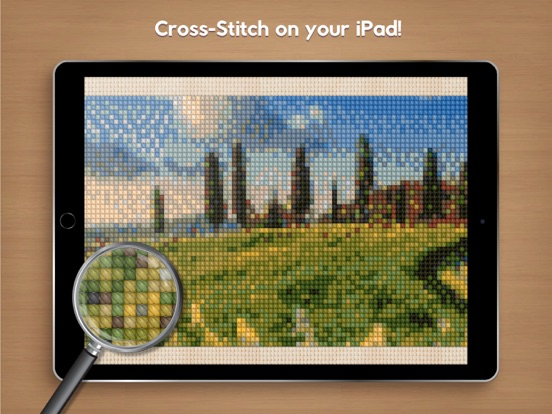
<!-- slide -->
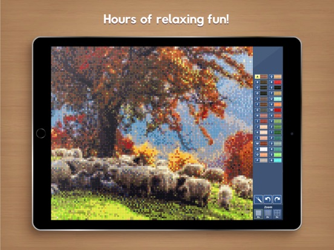
<!-- slide -->
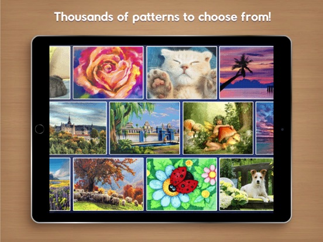

````

---

## 2. Cross Stitch Club

**Geliştirici:** Andrey Baryshnikov  
**Kategoriler:** Games, Entertainment, Board, Puzzle  
**Puanlama:** 4.74644 ★ (3727 oy)  
**Fiyat:** Free  
**Aylık Tahmini İndirme:** ≤5,000  
**Aylık Tahmini Gelir:** ≤5,000 USD  

### Nasıl Çalışır?
Klasik Sayılarla Kanaviçe Boyama (Cross-Stitch Color by Number) tarzındadır. Oyuncular alt kısımda yer alan renk paletinden dikiş rengini seçer ve ızgara üzerinde karşılık gelen sayıları/harfleri doldurarak resmi tamamlar.

### Temel Özellikler
- Zengin şablon kütüphanesi
- Dikiş dokusu efekti
- İpucu ve otomatik doldurma araçları

### Oyun İçi Ekran Görüntüleri

````carousel
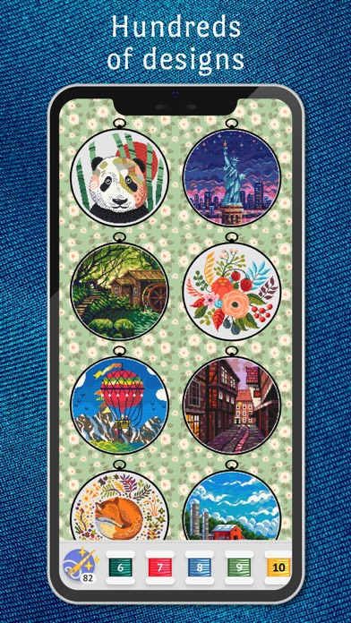
<!-- slide -->
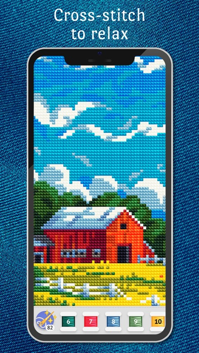
<!-- slide -->
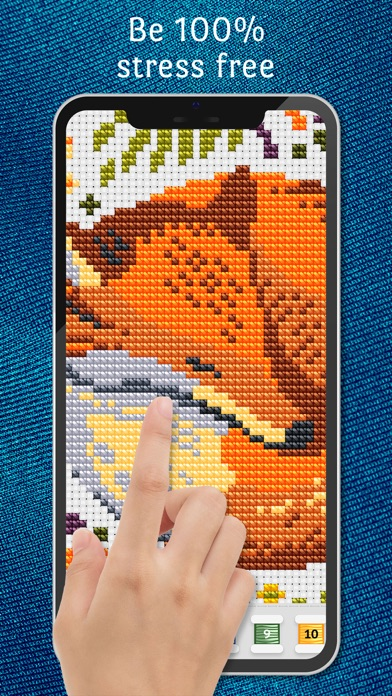

````

---

## 3. Cross-Stitch: Coloring Book

**Geliştirici:** Marcos Roy  
**Kategoriler:** Entertainment, Lifestyle  
**Puanlama:** 3.85714 ★ (7 oy)  
**Fiyat:** Free  
**Aylık Tahmini İndirme:** ≤5,000  
**Aylık Tahmini Gelir:** ≤5,000 USD  

### Nasıl Çalışır?
Klasik Sayılarla Kanaviçe Boyama (Cross-Stitch Color by Number) tarzındadır. Oyuncular alt kısımda yer alan renk paletinden dikiş rengini seçer ve ızgara üzerinde karşılık gelen sayıları/harfleri doldurarak resmi tamamlar.

### Temel Özellikler
- Zengin şablon kütüphanesi
- Dikiş dokusu efekti
- İpucu ve otomatik doldurma araçları

### Ekran Görüntüleri
*Bu uygulama için ekran görüntüsü indirilemedi (Google Play veya lokal mağaza kısıtlaması).*

---

## 4. Stitchly: Cross stitch

**Geliştirici:** Subtlabs Ltd  
**Kategoriler:** Lifestyle, Entertainment  
**Puanlama:** 4.78137 ★ (2008 oy)  
**Fiyat:** Free  
**Aylık Tahmini İndirme:** ≤5,000  
**Aylık Tahmini Gelir:** 30,000 USD  

### Nasıl Çalışır?
Klasik Sayılarla Kanaviçe Boyama (Cross-Stitch Color by Number) tarzındadır. Oyuncular alt kısımda yer alan renk paletinden dikiş rengini seçer ve ızgara üzerinde karşılık gelen sayıları/harfleri doldurarak resmi tamamlar.

### Temel Özellikler
- Zengin şablon kütüphanesi
- Dikiş dokusu efekti
- İpucu ve otomatik doldurma araçları

### Oyun İçi Ekran Görüntüleri

````carousel
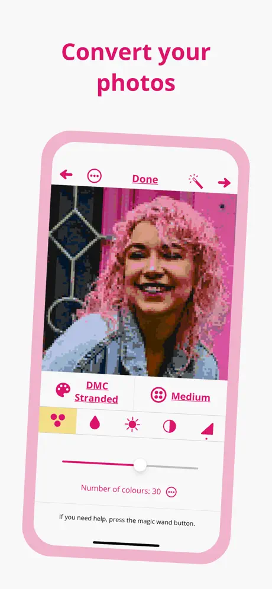
<!-- slide -->
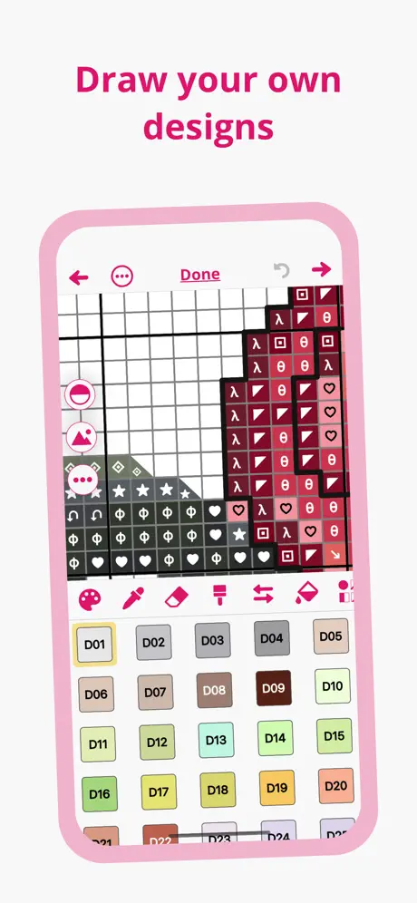
<!-- slide -->
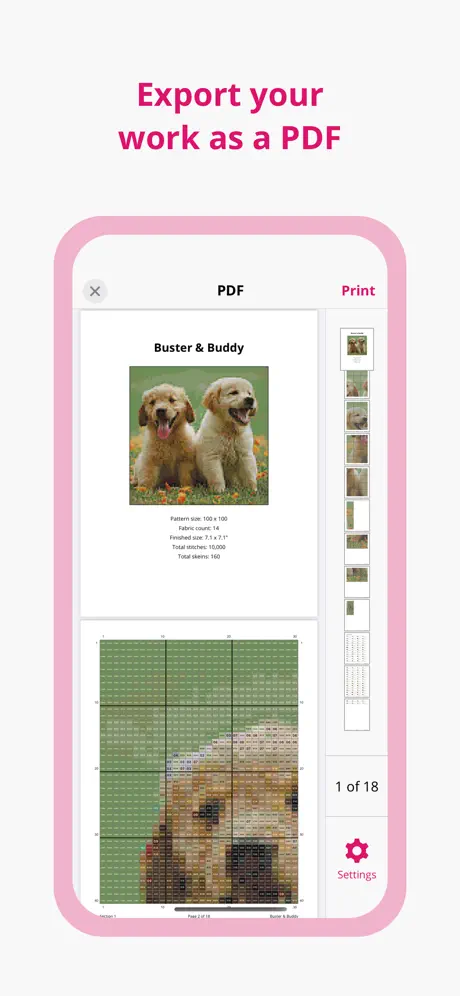

````

---

## 5. Cross-Stitch Masters

**Geliştirici:** TAPCLAP LIMITED  
**Kategoriler:** Games, Board, Graphics & Design, Puzzle  
**Puanlama:** 4.62422 ★ (801 oy)  
**Fiyat:** Free  
**Aylık Tahmini İndirme:** ≤5,000  
**Aylık Tahmini Gelir:** ≤5,000 USD  

### Nasıl Çalışır?
Klasik Sayılarla Kanaviçe Boyama (Cross-Stitch Color by Number) tarzındadır. Oyuncular alt kısımda yer alan renk paletinden dikiş rengini seçer ve ızgara üzerinde karşılık gelen sayıları/harfleri doldurarak resmi tamamlar.

### Temel Özellikler
- Zengin şablon kütüphanesi
- Dikiş dokusu efekti
- İpucu ve otomatik doldurma araçları

### Oyun İçi Ekran Görüntüleri

````carousel
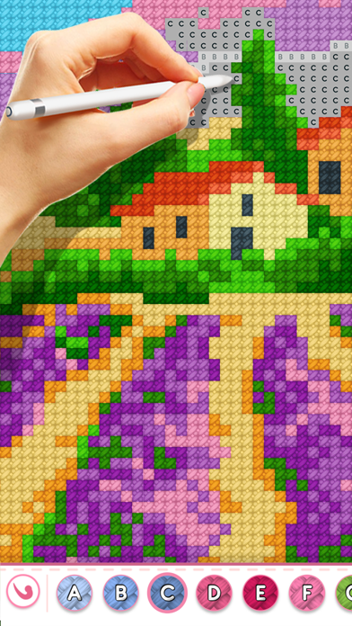
<!-- slide -->
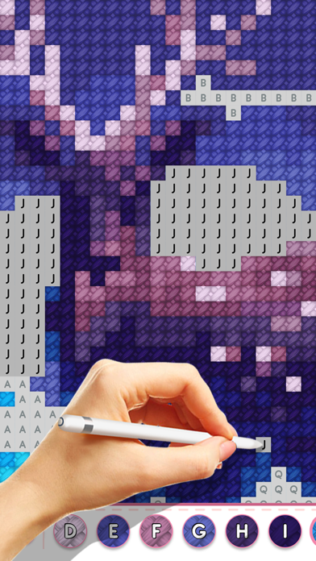
<!-- slide -->
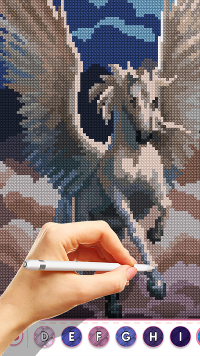

````

---

## 6. Cross Stitch Saga

**Geliştirici:** Irina Kopylova  
**Kategoriler:** Lifestyle, Productivity  
**Puanlama:** 4.44444 ★ (54 oy)  
**Fiyat:** $15.00  
**Aylık Tahmini İndirme:** -  
**Aylık Tahmini Gelir:** ≤5,000 USD  

### Nasıl Çalışır?
Profesyonel kanaviçe şemalarını okuma (viewer) ve dikiş takibi yapma uygulamasıdır. Kullanıcılar kendi şablonlarını (.xsd, .pat, .pdf vb.) uygulamaya aktararak renk, simge ve ilmek takibi yapar.

### Temel Özellikler
- XSD, PAT, PDF dosya desteği
- İplik renk kodlarını (DMC, Anchor vb.) eşleştirme
- Büyüteç, ilmek sayacı ve ilerleme takibi

### Oyun İçi Ekran Görüntüleri

````carousel
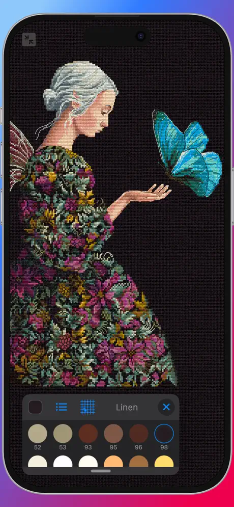
<!-- slide -->
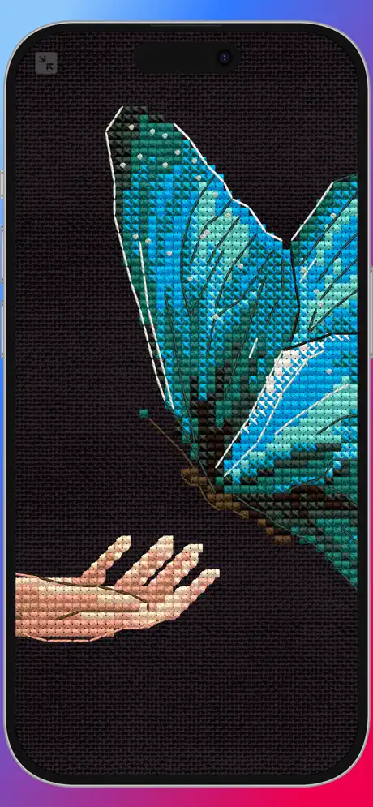
<!-- slide -->
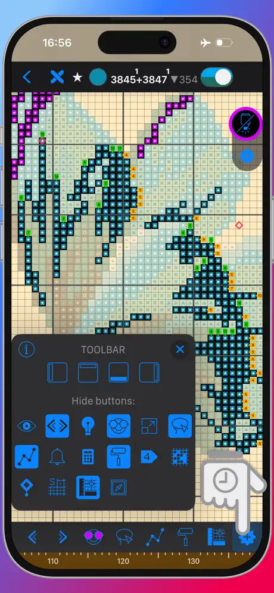

````

---

## 7. Cross Stitch: Coloring Art

**Geliştirici:** PLAYCUS LIMITED  
**Kategoriler:** Games, Board, Entertainment, Puzzle  
**Puanlama:** 4.58944 ★ (4506 oy)  
**Fiyat:** Free  
**Aylık Tahmini İndirme:** ≤5,000  
**Aylık Tahmini Gelir:** ≤5,000 USD  

### Nasıl Çalışır?
Klasik Sayılarla Kanaviçe Boyama (Cross-Stitch Color by Number) tarzındadır. Oyuncular alt kısımda yer alan renk paletinden dikiş rengini seçer ve ızgara üzerinde karşılık gelen sayıları/harfleri doldurarak resmi tamamlar.

### Temel Özellikler
- Zengin şablon kütüphanesi
- Dikiş dokusu efekti
- İpucu ve otomatik doldurma araçları

### Oyun İçi Ekran Görüntüleri

````carousel
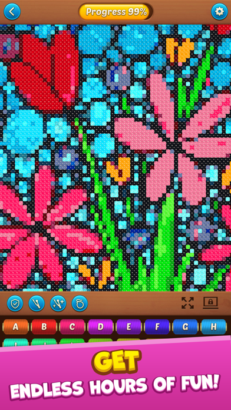
<!-- slide -->
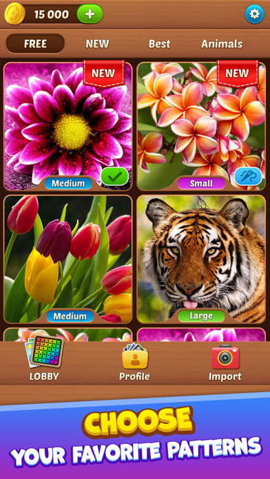
<!-- slide -->
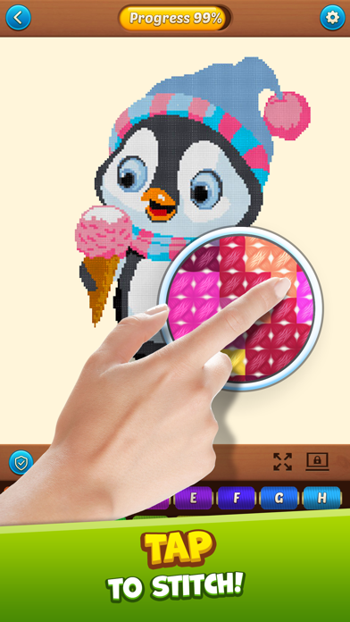

````

---

## 8. Cross-Stitch: Color by Number

**Geliştirici:** Tho Huynh Ngoc  
**Kategoriler:** Games, Board, Entertainment, Puzzle  
**Puanlama:** 4.77482 ★ (151 oy)  
**Fiyat:** Free  
**Aylık Tahmini İndirme:** ≤5,000  
**Aylık Tahmini Gelir:** ≤5,000 USD  

### Nasıl Çalışır?
Klasik Sayılarla Kanaviçe Boyama (Cross-Stitch Color by Number) tarzındadır. Oyuncular alt kısımda yer alan renk paletinden dikiş rengini seçer ve ızgara üzerinde karşılık gelen sayıları/harfleri doldurarak resmi tamamlar.

### Temel Özellikler
- Zengin şablon kütüphanesi
- Dikiş dokusu efekti
- İpucu ve otomatik doldurma araçları

### Oyun İçi Ekran Görüntüleri

````carousel
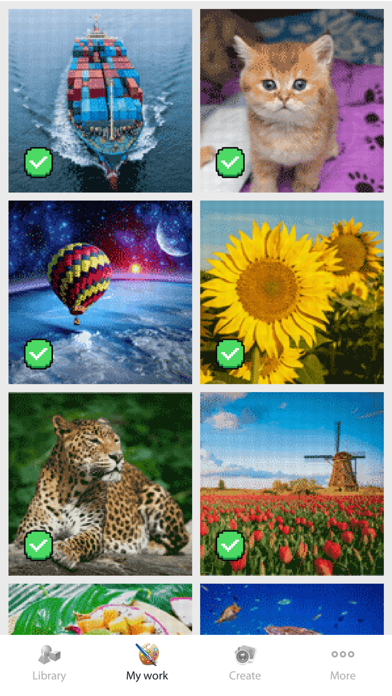
<!-- slide -->
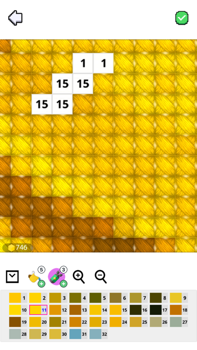
<!-- slide -->
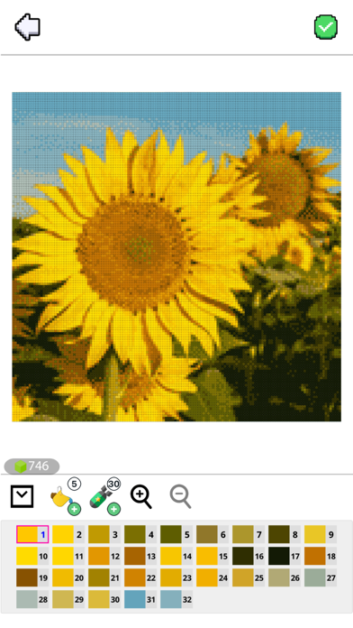

````

---

## 9. Cross Stitch King

**Geliştirici:** MOBIRIX  
**Kategoriler:** Games, Puzzle, Entertainment, Board  
**Puanlama:** 4.69608 ★ (612 oy)  
**Fiyat:** Free  
**Aylık Tahmini İndirme:** ≤5,000  
**Aylık Tahmini Gelir:** - USD  

### Nasıl Çalışır?
Klasik Sayılarla Kanaviçe Boyama (Cross-Stitch Color by Number) tarzındadır. Oyuncular alt kısımda yer alan renk paletinden dikiş rengini seçer ve ızgara üzerinde karşılık gelen sayıları/harfleri doldurarak resmi tamamlar.

### Temel Özellikler
- Zengin şablon kütüphanesi
- Dikiş dokusu efekti
- İpucu ve otomatik doldurma araçları

### Oyun İçi Ekran Görüntüleri

````carousel
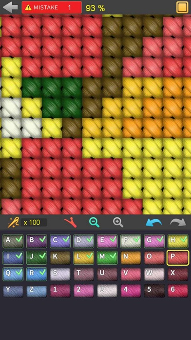
<!-- slide -->
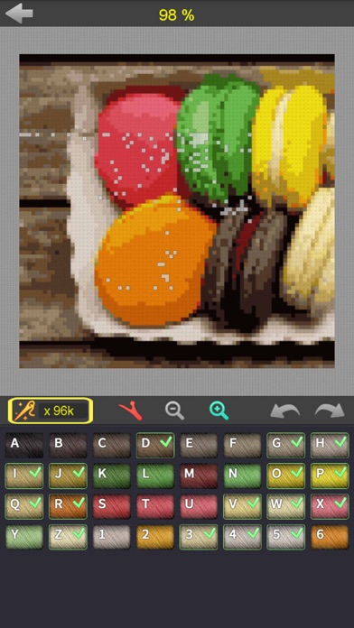
<!-- slide -->
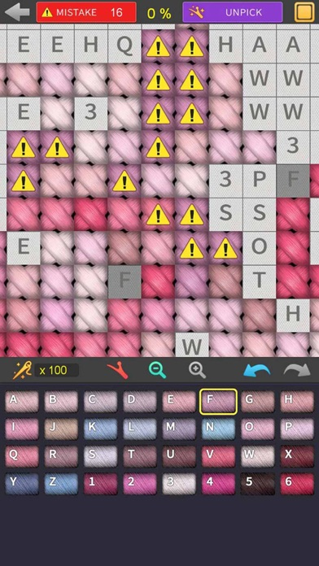

````

---

## 10. Magic Needle: Cross-Stitch

**Geliştirici:** Artem Shal  
**Kategoriler:** Lifestyle, Entertainment  
**Puanlama:** 4.38159 ★ (1119 oy)  
**Fiyat:** Free  
**Aylık Tahmini İndirme:** ≤5,000  
**Aylık Tahmini Gelir:** ≤5,000 USD  

### Nasıl Çalışır?
Klasik Sayılarla Kanaviçe Boyama (Cross-Stitch Color by Number) tarzındadır. Oyuncular alt kısımda yer alan renk paletinden dikiş rengini seçer ve ızgara üzerinde karşılık gelen sayıları/harfleri doldurarak resmi tamamlar.

### Temel Özellikler
- Zengin şablon kütüphanesi
- Dikiş dokusu efekti
- İpucu ve otomatik doldurma araçları

### Oyun İçi Ekran Görüntüleri

````carousel
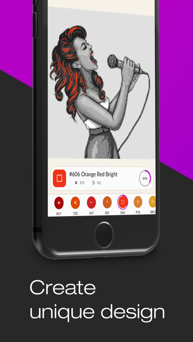
<!-- slide -->
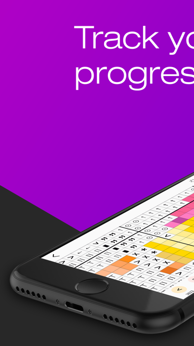
<!-- slide -->
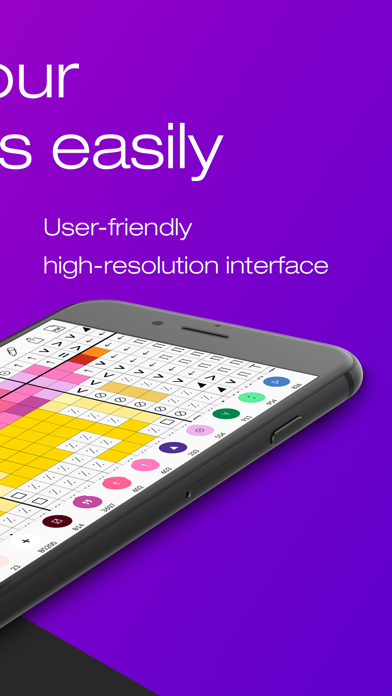

````

---

## 11. Cross Stitch Coloring Mandala

**Geliştirici:** PLAYCUS LIMITED  
**Kategoriler:** Games, Board, Puzzle, Entertainment  
**Puanlama:** 4.6464 ★ (1957 oy)  
**Fiyat:** Free  
**Aylık Tahmini İndirme:** ≤5,000  
**Aylık Tahmini Gelir:** ≤5,000 USD  

### Nasıl Çalışır?
Kanaviçe dikiş mantığıyla Mandala çizimlerini boyama oyunudur. Dairesel simetrik desenler, sayılarla boyama yöntemiyle dikiş dokusu verilerek renklendirilir.

### Temel Özellikler
- Simetrik mandala şablonları
- Zihinsel rahatlatıcı müzik ve görseller
- Çevrimdışı oynama seçeneği

### Oyun İçi Ekran Görüntüleri

````carousel
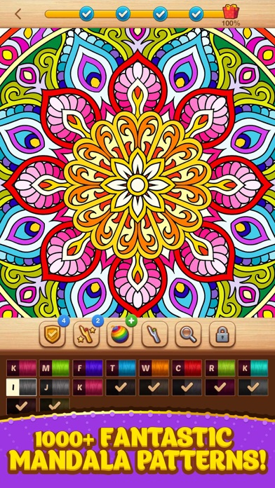
<!-- slide -->
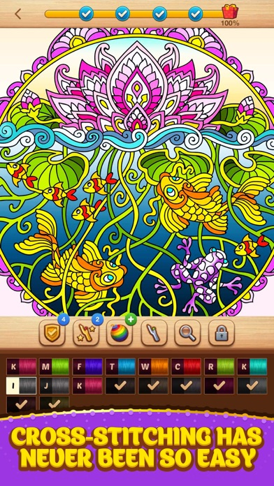
<!-- slide -->
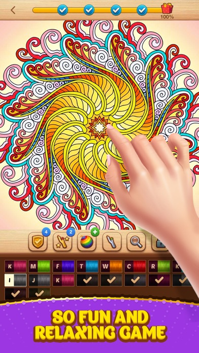

````

---

## 12. Magic Cross-Stitch: Pixel Art

**Geliştirici:** XIMAD, Inc.  
**Kategoriler:** Games, Entertainment, Puzzle, Board  
**Puanlama:** 4.84907 ★ (6387 oy)  
**Fiyat:** Free  
**Aylık Tahmini İndirme:** 40,000  
**Aylık Tahmini Gelir:** ≤5,000 USD  

### Nasıl Çalışır?
Klasik Sayılarla Kanaviçe Boyama (Cross-Stitch Color by Number) tarzındadır. Oyuncular alt kısımda yer alan renk paletinden dikiş rengini seçer ve ızgara üzerinde karşılık gelen sayıları/harfleri doldurarak resmi tamamlar.

### Temel Özellikler
- Zengin şablon kütüphanesi
- Dikiş dokusu efekti
- İpucu ve otomatik doldurma araçları

### Oyun İçi Ekran Görüntüleri

````carousel
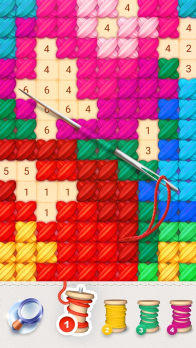
<!-- slide -->
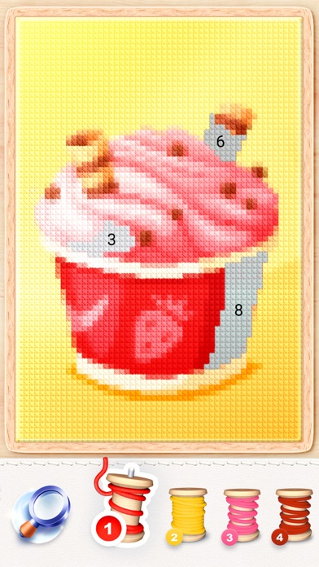
<!-- slide -->
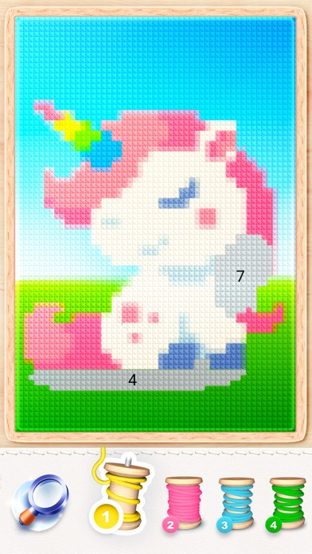

````

---

## 13. XStitch Calculator

**Geliştirici:** Lykkegaard Europe Limited  
**Kategoriler:** Games, Puzzle  
**Puanlama:** 4.82932 ★ (34503 oy)  
**Fiyat:** Free  
**Aylık Tahmini İndirme:** ≤5,000  
**Aylık Tahmini Gelir:** - USD  

### Nasıl Çalışır?
Kanaviçe projenizin kumaş boyutunu, iplik uzunluğunu ve dikiş boyutlarını hesaplamak için kullanılan bir araçtır. Kullanıcı kumaş türünü (Aida, Keten vb.) ve dikiş sayılarını girerek nakış projesinin nihai boyutlarını hesaplar.

### Temel Özellikler
- Kumaş boyut hesaplama
- İplik miktarı tahminleme
- Dikiş sıklığı (count) dönüştürme araçları

### Oyun İçi Ekran Görüntüleri

````carousel

<!-- slide -->

<!-- slide -->


````

---

## 14. Cross Stitch Creator

**Geliştirici:** GORA Studio  
**Kategoriler:** Productivity  
**Puanlama:** 3 ★ (1 oy)  
**Fiyat:** Free  
**Aylık Tahmini İndirme:** -  
**Aylık Tahmini Gelir:** - USD  

### Nasıl Çalışır?
Kullanıcıların kendi resimlerini veya fotoğraflarını kanaviçe/etamin şemalarına dönüştürmelerini sağlayan yaratıcı bir araçtır. Fotoğrafları piksel sanatına ve dikiş şablonuna çevirir.

### Temel Özellikler
- Görselleri şablonlara dönüştürme
- Özel renk paleti ve dikiş ızgarası tasarımı
- PDF veya resim formatında şema çıktısı alma

### Oyun İçi Ekran Görüntüleri

````carousel
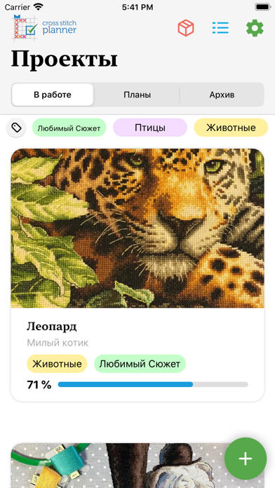
<!-- slide -->

<!-- slide -->


````

---

## 15. Silk: Cross Stitch Patterns

**Geliştirici:** CSP Embroidery Digital UG haftungsbeschrankt  
**Kategoriler:** Lifestyle, Shopping  
**Puanlama:** 4.79115 ★ (498 oy)  
**Fiyat:** Free  
**Aylık Tahmini İndirme:** ≤5,000  
**Aylık Tahmini Gelir:** ≤5,000 USD  

### Nasıl Çalışır?
Klasik Sayılarla Kanaviçe Boyama (Cross-Stitch Color by Number) tarzındadır. Oyuncular alt kısımda yer alan renk paletinden dikiş rengini seçer ve ızgara üzerinde karşılık gelen sayıları/harfleri doldurarak resmi tamamlar.

### Temel Özellikler
- Zengin şablon kütüphanesi
- Dikiş dokusu efekti
- İpucu ve otomatik doldurma araçları

### Oyun İçi Ekran Görüntüleri

````carousel
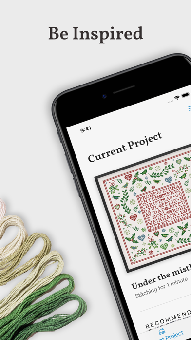
<!-- slide -->
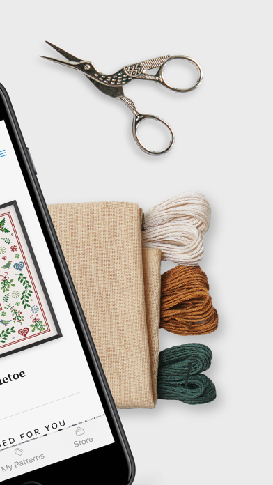
<!-- slide -->


````

---

## 16. StitchPics - Stitch Screenshots

**Geliştirici:** Lykkegaard Europe Limited  
**Kategoriler:** Games, Puzzle  
**Puanlama:** 4.82932 ★ (34503 oy)  
**Fiyat:** Free  
**Aylık Tahmini İndirme:** ≤5,000  
**Aylık Tahmini Gelir:** ≤5,000 USD  

### Nasıl Çalışır?
Kullanıcıların kendi resimlerini veya fotoğraflarını kanaviçe/etamin şemalarına dönüştürmelerini sağlayan yaratıcı bir araçtır. Fotoğrafları piksel sanatına ve dikiş şablonuna çevirir.

### Temel Özellikler
- Görselleri şablonlara dönüştürme
- Özel renk paleti ve dikiş ızgarası tasarımı
- PDF veya resim formatında şema çıktısı alma

### Oyun İçi Ekran Görüntüleri

````carousel

<!-- slide -->
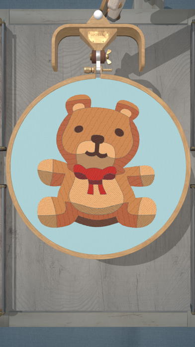
<!-- slide -->


````

---

## 17. Just CrossStitch

**Geliştirici:** Annie's Publishing, LLC  
**Kategoriler:** Lifestyle, Magazines & Newspapers  
**Puanlama:** 4.69643 ★ (112 oy)  
**Fiyat:** Free  
**Aylık Tahmini İndirme:** ≤5,000  
**Aylık Tahmini Gelir:** ≤5,000 USD  

### Nasıl Çalışır?
Klasik Sayılarla Kanaviçe Boyama (Cross-Stitch Color by Number) tarzındadır. Oyuncular alt kısımda yer alan renk paletinden dikiş rengini seçer ve ızgara üzerinde karşılık gelen sayıları/harfleri doldurarak resmi tamamlar.

### Temel Özellikler
- Zengin şablon kütüphanesi
- Dikiş dokusu efekti
- İpucu ve otomatik doldurma araçları

### Oyun İçi Ekran Görüntüleri

````carousel
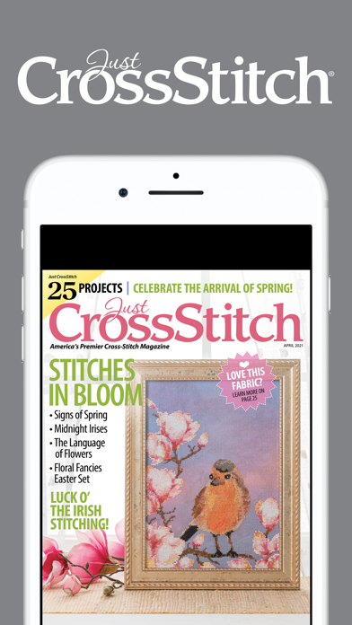
<!-- slide -->
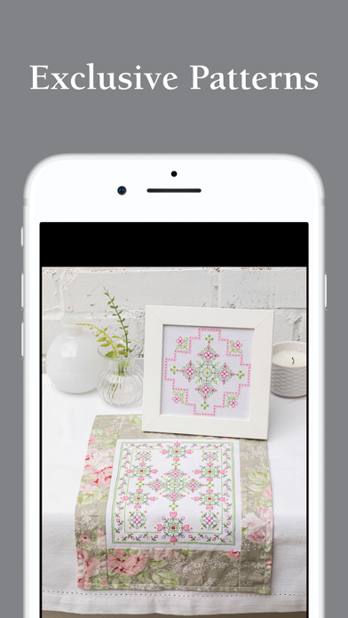
<!-- slide -->
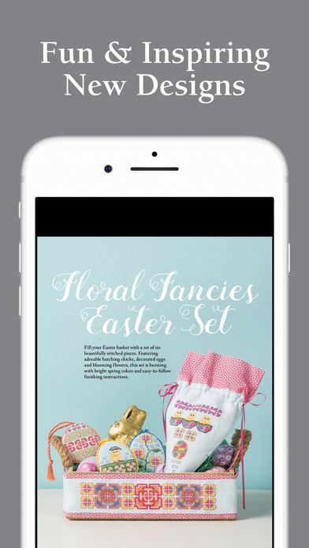

````

---

## 18. Cross Stitch Favourites

**Geliştirici:** Our Media Ltd  
**Kategoriler:** Lifestyle, Magazines & Newspapers  
**Puanlama:** 4.40541 ★ (37 oy)  
**Fiyat:** Free  
**Aylık Tahmini İndirme:** ≤5,000  
**Aylık Tahmini Gelir:** ≤5,000 USD  

### Nasıl Çalışır?
Klasik Sayılarla Kanaviçe Boyama (Cross-Stitch Color by Number) tarzındadır. Oyuncular alt kısımda yer alan renk paletinden dikiş rengini seçer ve ızgara üzerinde karşılık gelen sayıları/harfleri doldurarak resmi tamamlar.

### Temel Özellikler
- Zengin şablon kütüphanesi
- Dikiş dokusu efekti
- İpucu ve otomatik doldurma araçları

### Oyun İçi Ekran Görüntüleri

````carousel
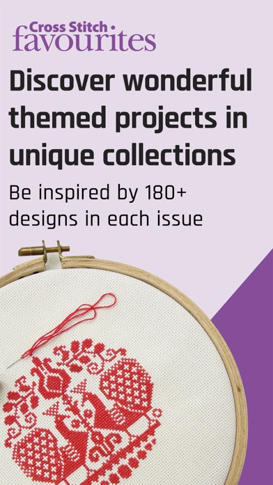
<!-- slide -->
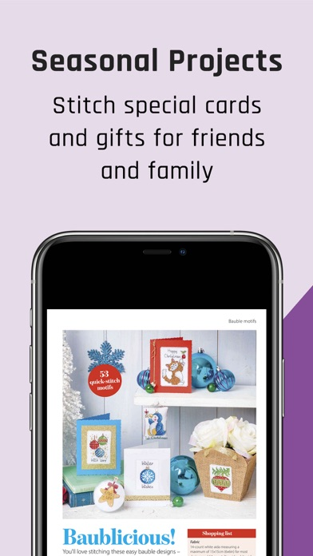
<!-- slide -->
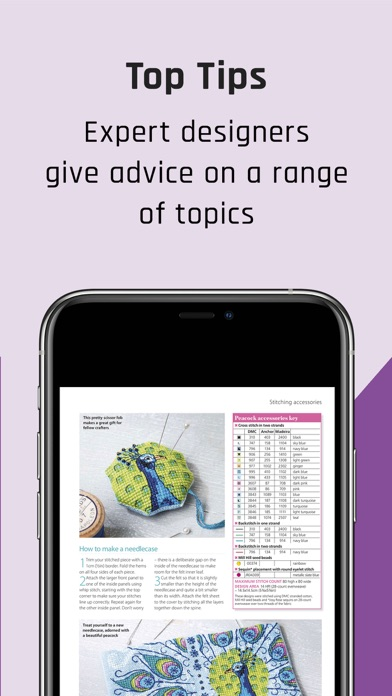

````

---

## 19. Cross Stitch Quest - Sewing Pattern Mania

**Geliştirici:** Arbel Eshed  
**Kategoriler:** Games, Family, Puzzle  
**Puanlama:** 3.94444 ★ (54 oy)  
**Fiyat:** Free  
**Aylık Tahmini İndirme:** ≤5,000  
**Aylık Tahmini Gelir:** - USD  

### Nasıl Çalışır?
Klasik Sayılarla Kanaviçe Boyama (Cross-Stitch Color by Number) tarzındadır. Oyuncular alt kısımda yer alan renk paletinden dikiş rengini seçer ve ızgara üzerinde karşılık gelen sayıları/harfleri doldurarak resmi tamamlar.

### Temel Özellikler
- Zengin şablon kütüphanesi
- Dikiş dokusu efekti
- İpucu ve otomatik doldurma araçları

### Oyun İçi Ekran Görüntüleri

````carousel
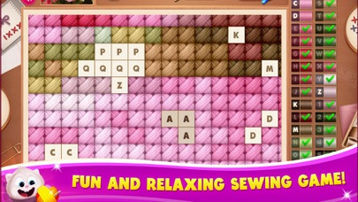
<!-- slide -->
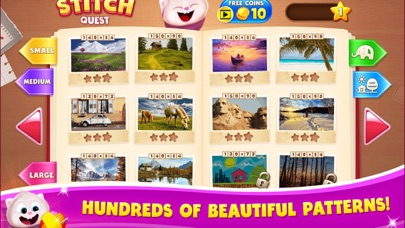
<!-- slide -->
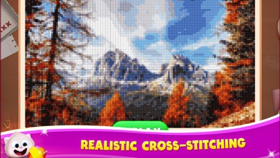

````

---

## 20. Cross Stitch Embroidery Art

**Geliştirici:** GORA Studio  
**Kategoriler:** Productivity  
**Puanlama:** 3 ★ (1 oy)  
**Fiyat:** Free  
**Aylık Tahmini İndirme:** ≤5,000  
**Aylık Tahmini Gelir:** ≤5,000 USD  

### Nasıl Çalışır?
Klasik Sayılarla Kanaviçe Boyama (Cross-Stitch Color by Number) tarzındadır. Oyuncular alt kısımda yer alan renk paletinden dikiş rengini seçer ve ızgara üzerinde karşılık gelen sayıları/harfleri doldurarak resmi tamamlar.

### Temel Özellikler
- Zengin şablon kütüphanesi
- Dikiş dokusu efekti
- İpucu ve otomatik doldurma araçları

### Oyun İçi Ekran Görüntüleri

````carousel

<!-- slide -->

<!-- slide -->


````

---

## 21. Cross Stitch: Color by Letters

**Geliştirici:** PLAYCUS LIMITED  
**Kategoriler:** Games, Board, Entertainment, Puzzle  
**Puanlama:** 4.50911 ★ (823 oy)  
**Fiyat:** Free  
**Aylık Tahmini İndirme:** ≤5,000  
**Aylık Tahmini Gelir:** ≤5,000 USD  

### Nasıl Çalışır?
Klasik Sayılarla Kanaviçe Boyama (Cross-Stitch Color by Number) tarzındadır. Oyuncular alt kısımda yer alan renk paletinden dikiş rengini seçer ve ızgara üzerinde karşılık gelen sayıları/harfleri doldurarak resmi tamamlar.

### Temel Özellikler
- Zengin şablon kütüphanesi
- Dikiş dokusu efekti
- İpucu ve otomatik doldurma araçları

### Oyun İçi Ekran Görüntüleri

````carousel
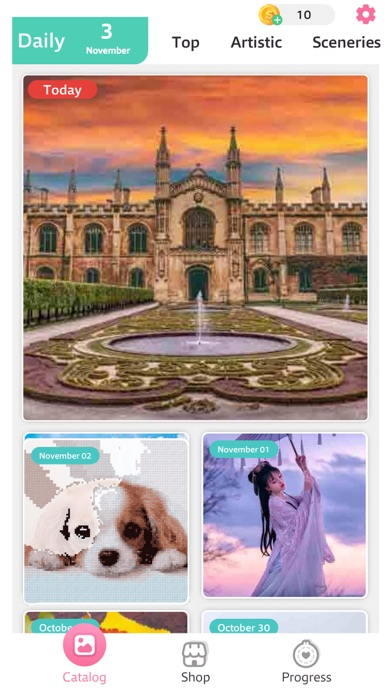
<!-- slide -->
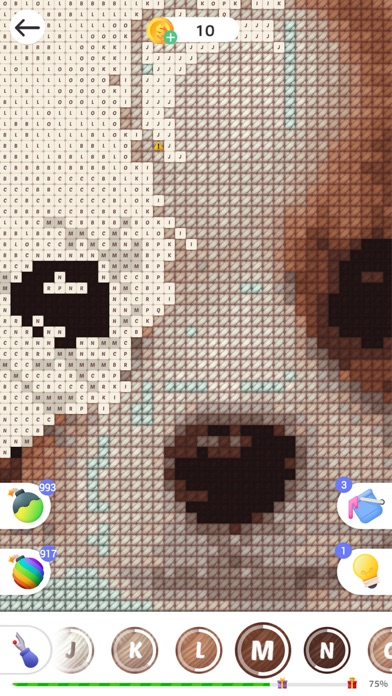
<!-- slide -->
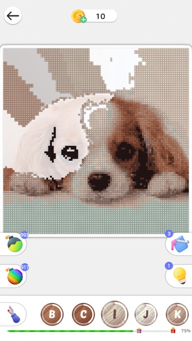

````

---

## 22. Cross Stitch Joy

**Geliştirici:** GORA Studio  
**Kategoriler:** Productivity  
**Puanlama:** 3 ★ (1 oy)  
**Fiyat:** Free  
**Aylık Tahmini İndirme:** ≤5,000  
**Aylık Tahmini Gelir:** ≤5,000 USD  

### Nasıl Çalışır?
Android platformundaki en popüler klasik kanaviçe oyunlarından biridir. Oyuncular ızgaralar üzerindeki harf ve sayılarla belirtilen renk alanlarını boyayarak kanaviçe nakışını tamamlarlar.

### Temel Özellikler
- Gerçekçi dikiş animasyonu
- Büyüteç ve kolay boyama modu
- Farklı zorluk seviyeleri

### Oyun İçi Ekran Görüntüleri

````carousel

<!-- slide -->
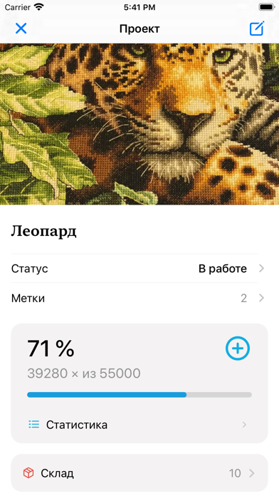
<!-- slide -->
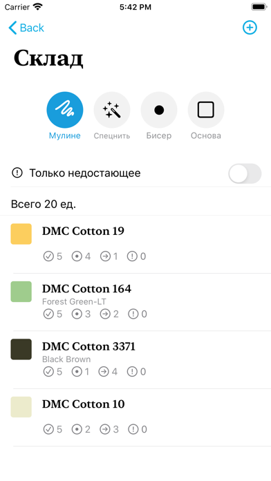

````

---

## 23. Cross Stitch Blitz

**Geliştirici:** Gravity Limited Liability Company  
**Kategoriler:** Games, Puzzle, Board  
**Puanlama:** 3.5 ★ (26 oy)  
**Fiyat:** Free  
**Aylık Tahmini İndirme:** ≤5,000  
**Aylık Tahmini Gelir:** - USD  

### Nasıl Çalışır?
Klasik Sayılarla Kanaviçe Boyama (Cross-Stitch Color by Number) tarzındadır. Oyuncular alt kısımda yer alan renk paletinden dikiş rengini seçer ve ızgara üzerinde karşılık gelen sayıları/harfleri doldurarak resmi tamamlar.

### Temel Özellikler
- Zengin şablon kütüphanesi
- Dikiş dokusu efekti
- İpucu ve otomatik doldurma araçları

### Oyun İçi Ekran Görüntüleri

````carousel
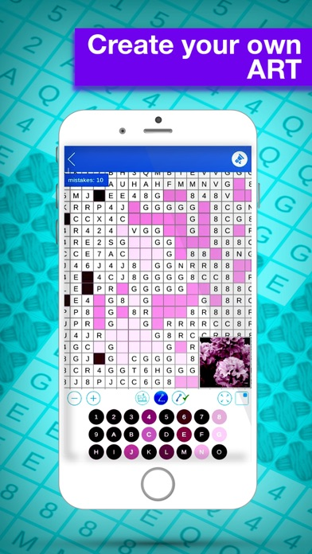
<!-- slide -->
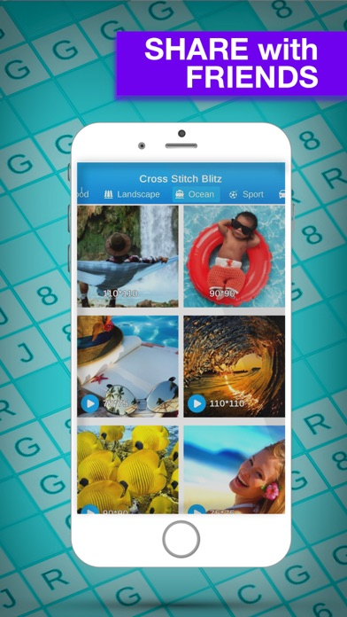
<!-- slide -->
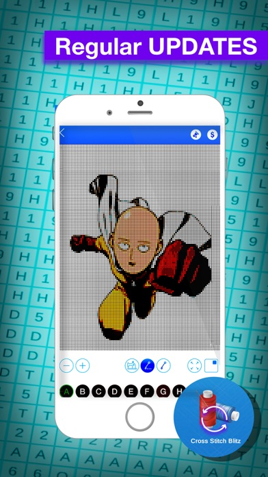

````

---

## 24. Cross stitch : Color by Letter

**Geliştirici:** EYEWIND LIMITED.  
**Kategoriler:** Entertainment, Games  
**Puanlama:** 4.28387 ★ (155 oy)  
**Fiyat:** Free  
**Aylık Tahmini İndirme:** ≤5,000  
**Aylık Tahmini Gelir:** ≤5,000 USD  

### Nasıl Çalışır?
Klasik Sayılarla Kanaviçe Boyama (Cross-Stitch Color by Number) tarzındadır. Oyuncular alt kısımda yer alan renk paletinden dikiş rengini seçer ve ızgara üzerinde karşılık gelen sayıları/harfleri doldurarak resmi tamamlar.

### Temel Özellikler
- Zengin şablon kütüphanesi
- Dikiş dokusu efekti
- İpucu ve otomatik doldurma araçları

### Oyun İçi Ekran Görüntüleri

````carousel
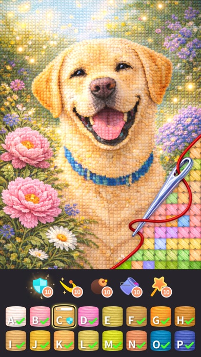
<!-- slide -->
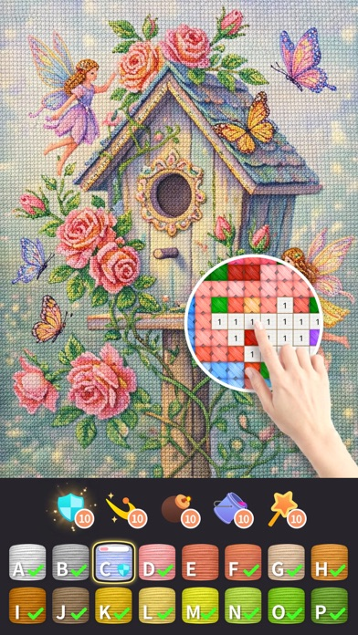
<!-- slide -->
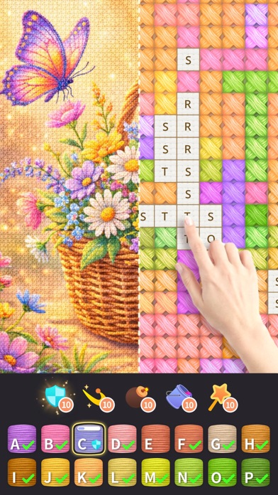

````

---

## 25. Cross Stitch Calculator

**Geliştirici:** Goatella  
**Kategoriler:** Lifestyle, Reference  
**Puanlama:** 3.93333 ★ (15 oy)  
**Fiyat:** Free  
**Aylık Tahmini İndirme:** -  
**Aylık Tahmini Gelir:** - USD  

### Nasıl Çalışır?
Kanaviçe projenizin kumaş boyutunu, iplik uzunluğunu ve dikiş boyutlarını hesaplamak için kullanılan bir araçtır. Kullanıcı kumaş türünü (Aida, Keten vb.) ve dikiş sayılarını girerek nakış projesinin nihai boyutlarını hesaplar.

### Temel Özellikler
- Kumaş boyut hesaplama
- İplik miktarı tahminleme
- Dikiş sıklığı (count) dönüştürme araçları

### Oyun İçi Ekran Görüntüleri

````carousel
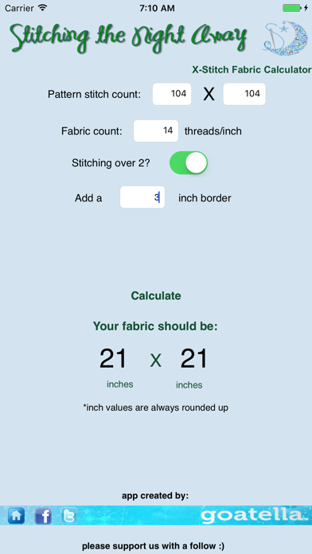
<!-- slide -->
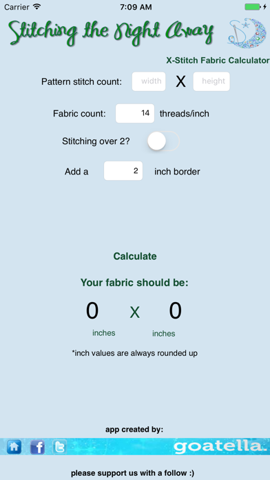
<!-- slide -->
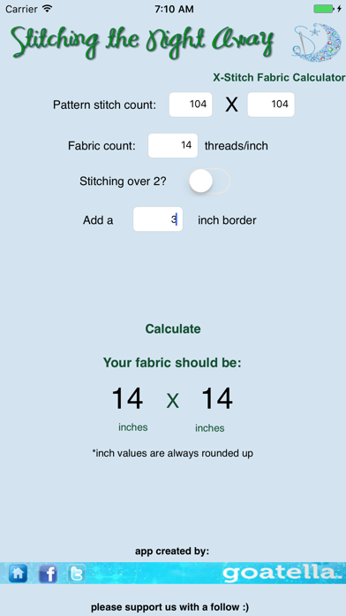

````

---

## 26. Stitch Fix - Personal Styling

**Geliştirici:** Lykkegaard Europe Limited  
**Kategoriler:** Games, Puzzle  
**Puanlama:** 4.82932 ★ (34503 oy)  
**Fiyat:** Free  
**Aylık Tahmini İndirme:** 45,000  
**Aylık Tahmini Gelir:** - USD  

### Nasıl Çalışır?
Bu uygulama bir kanaviçe (cross-stitch) oyunu değildir. İsim eşleşmesinden dolayı arama sonuçlarına dahil olmuştur. Stitch Fix - Personal Styling bir kişisel stil/düzenleme veya görsel editörü uygulamasıdır.

### Temel Özellikler
- Tasarım ve stil önerileri
- Kombin oluşturma
- Görsel veya kolaj düzenleme araçları

### Oyun İçi Ekran Görüntüleri

````carousel

<!-- slide -->

<!-- slide -->


````

---

## 27. Cross Stitch: Pixel Art

**Geliştirici:** 尚辉 曾  
**Kategoriler:** Entertainment, Casual, Puzzle, Games  
**Puanlama:** 4.65327 ★ (672 oy)  
**Fiyat:** Free  
**Aylık Tahmini İndirme:** ≤5,000  
**Aylık Tahmini Gelir:** ≤5,000 USD  

### Nasıl Çalışır?
Klasik Sayılarla Kanaviçe Boyama (Cross-Stitch Color by Number) tarzındadır. Oyuncular alt kısımda yer alan renk paletinden dikiş rengini seçer ve ızgara üzerinde karşılık gelen sayıları/harfleri doldurarak resmi tamamlar.

### Temel Özellikler
- Zengin şablon kütüphanesi
- Dikiş dokusu efekti
- İpucu ve otomatik doldurma araçları

### Oyun İçi Ekran Görüntüleri

````carousel
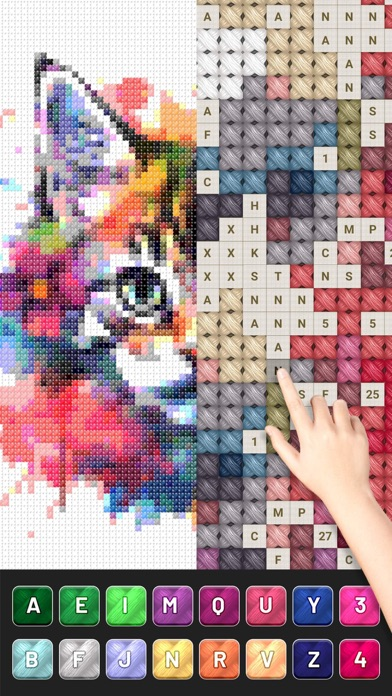
<!-- slide -->
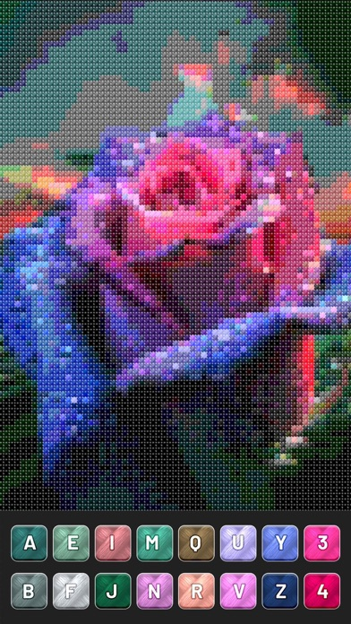
<!-- slide -->
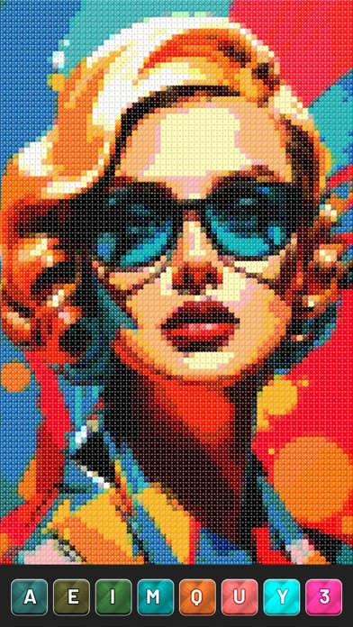

````

---

## 28. Picture Cross

**Geliştirici:** AppyNation Ltd.  
**Kategoriler:** Games  
**Puanlama:** Bilinmiyor ★ (0 oy)  
**Fiyat:** Paid  
**Aylık Tahmini İndirme:** ≤5,000  
**Aylık Tahmini Gelir:** 55,000 USD  

### Nasıl Çalışır?
Piksel bulmaca mantığına (Nonogram/Griddler) dayanır. Oyuncular satır ve sütun başlarındaki sayıları kullanarak hangi karelerin boyanacağını mantıksal olarak hesaplar ve resmi ortaya çıkarırlar.

### Temel Özellikler
- Zeka ve mantık geliştirici bulmacalar
- Büyük ızgaralar (15x15, 20x20 vb.)
- Temalı haritalar ve koleksiyonlar

### Ekran Görüntüleri
*Bu uygulama için ekran görüntüsü indirilemedi (Google Play veya lokal mağaza kısıtlaması).*

---

## 29. Cross Stitch: Color by Number

**Geliştirici:** Tho Huynh Ngoc  
**Kategoriler:** Games, Board, Entertainment, Puzzle  
**Puanlama:** 4.77482 ★ (151 oy)  
**Fiyat:** Free  
**Aylık Tahmini İndirme:** ≤5,000  
**Aylık Tahmini Gelir:** ≤5,000 USD  

### Nasıl Çalışır?
Klasik Sayılarla Kanaviçe Boyama (Cross-Stitch Color by Number) tarzındadır. Oyuncular alt kısımda yer alan renk paletinden dikiş rengini seçer ve ızgara üzerinde karşılık gelen sayıları/harfleri doldurarak resmi tamamlar.

### Temel Özellikler
- Zengin şablon kütüphanesi
- Dikiş dokusu efekti
- İpucu ve otomatik doldurma araçları

### Oyun İçi Ekran Görüntüleri

````carousel

<!-- slide -->

<!-- slide -->


````

---

## 30. Pic Stitch - Collage Editor

**Geliştirici:** Lykkegaard Europe Limited  
**Kategoriler:** Games, Puzzle  
**Puanlama:** 4.82932 ★ (34503 oy)  
**Fiyat:** Free  
**Aylık Tahmini İndirme:** 10,000  
**Aylık Tahmini Gelir:** 100,000 USD  

### Nasıl Çalışır?
Bu uygulama bir kanaviçe (cross-stitch) oyunu değildir. İsim eşleşmesinden dolayı arama sonuçlarına dahil olmuştur. Pic Stitch - Collage Editor bir kişisel stil/düzenleme veya görsel editörü uygulamasıdır.

### Temel Özellikler
- Tasarım ve stil önerileri
- Kombin oluşturma
- Görsel veya kolaj düzenleme araçları

### Oyun İçi Ekran Görüntüleri

````carousel
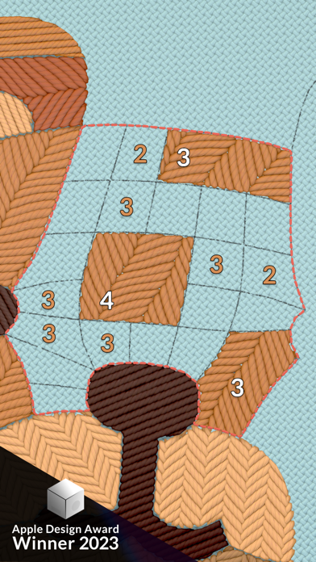
<!-- slide -->

<!-- slide -->
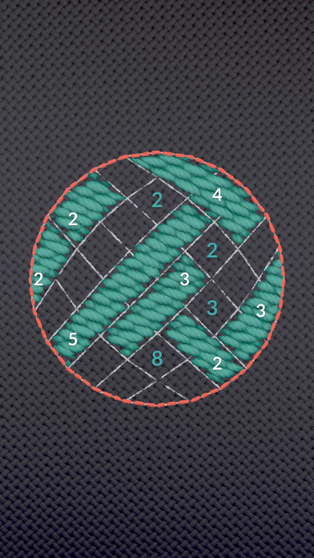

````

---
